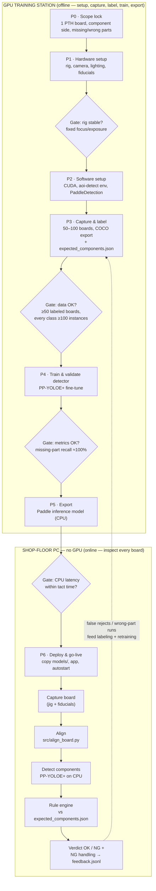

# Executable plan — internal-use AOI pilot for a wave-soldered PTH PCBA

End-to-end plan to go from **zero** to an AI inspection station that detects
**missing and wrong components** on one simple wave-soldered through-hole
(PTH) PCBA, running on a **non-GPU** shop-floor computer. Training happens on
a separate GPU station; inference happens where the boards are.

Scope: **one board variant, one camera view (component side), internal use
only, detection branch only.** The flow diagram below is also rendered as
[flow_diagram.png](flow_diagram.png).

> **Scope history note:** an earlier version of this plan targeted solder-side
> defects with an anomaly-first approach. Solder inspection is now **out of
> scope**, so the flow is restored to **detection-first**: PP-YOLOE+ is the
> phase-1 deliverable, and the anomaly branch (PatchCore) is deferred to an
> optional Phase 7.



---

## Phase 0 — Scope & licensing note (internal use)

**Licensing.** Both chosen libraries are Apache 2.0 — PaddleDetection
(PP-YOLOE+) and Intel anomalib (deferred) — so there is no licensing obstacle
even if this ever leaves internal use. The only license trap in this space
would have been Ultralytics YOLO (AGPL), which forces open-sourcing or a paid
license for commercial use; it is deliberately not used here. Internal-use-
only still matters operationally: no uptime SLA, and the AI runs as a
*decision aid* next to human inspection until trust is established.

**Scope lock (write it down, tape it to the rig):**

- ONE board variant, wave-soldered PTH.
- ONE camera view: the **component (top) side**. Inspection happens either
  right after insertion / before wave, or after wave on the top side — pick
  one and fix it. (After-wave top-side is recommended for the pilot: it
  catches both insertion errors and any parts lost/dislodged during wave.)
- TWO defect types: **missing parts** and **wrong parts**.
- Wrong orientation is *not* a phase-1 target (the aspect-ratio heuristic in
  `src/infer_pipeline.py` is too coarse on its own; a rotate-aware detector
  is future work). Solder/appearance defects (scratches, solder balls,
  foreign particles) are deferred with the anomaly branch (Phase 7).

**Gate: proceed when…**
- [ ] Board variant chosen and frozen (revision recorded).
- [ ] Camera view + inspection point in the process chosen (pre-wave or
      post-wave top side).
- [ ] Success criterion written down (e.g. "zero missed missing-parts on the
      validation set; ≤ 2% false rejects").

---

## Phase 1 — Hardware setup (GPU training station + capture rig)

### Bill of materials

| Item | Budget tier | Midrange tier | Notes |
|------|-------------|---------------|-------|
| GPU training PC | Used RTX 3060 12 GB box — ~$600–900 | RTX 4070-class, 12 GB+ VRAM, 32 GB RAM — ~$1,500–2,500 | PP-YOLOE+ fine-tuning wants a real GPU; the small variant trains fine on 12 GB |
| Camera | Good fixed webcam with manual focus/exposure (e.g. Logitech Brio class) — ~$100–200 | USB3 machine-vision camera (HIKROBOT / Basler ace class) — ~$300–800 | Manual focus + manual exposure is non-negotiable; smallest component must cover ~15+ px |
| Lens | (integrated in webcam) | Fixed-focal C-mount, working distance set by jig height — ~$80–300 | Fill the frame with one board |
| Lighting | 2× LED bar + diffuser — ~$80–150 | 2× diffuse LED bar with mount arms — ~$200–400 | Angled ~45° from both sides; component bodies/markings must be evenly lit |
| Jig frame | Aluminum extrusion + printed corner stops — ~$50–150 | Machined cradle + rails — ~$150–300 | Board must land within a few mm every time; see `docs/station/` for a real-bench retrofit |
| Fiducial markers | Printed dark-circle stickers — ~$5 | — | 4 markers on the **jig**, near board corners; consumed by `src/align_board.py` |
| Enclosure | Cardboard/foam shroud — ~$20 | Light-tight shroud — ~$100–150 | Blocks ambient-light drift |
| **Shop-floor PC** | Existing office PC | Mini PC, i5/Ryzen 5, 16 GB RAM, **no GPU** — ~$400–700 | Runs CPU inference + the Streamlit app |

### Physical setup steps

1. Mount the camera rigidly above the jig, top-down on the component side;
   frame one board with ~5% margin. Working distance ~40–60 cm is typical
   (see `docs/station/station_modification_guide.md` for a lean-tube bench
   retrofit).
2. Set **manual** focus, exposure, gain, and white balance. Tape the
   settings down.
3. Mount the two LED bars on the rack uprights at ~45°, aimed at the work
   surface; avoid reflections on glossy component bodies and the PCB solder
   mask.
4. Stick the 4 fiducials on the jig where they are visible in every frame
   and never covered by the board.
5. Capture 20 test shots: reseat the same board between shots, then verify
   `src/align_board.py` aligns all of them (method should be `fiducials`).

**Gate: proceed when…**
- [ ] 20 reseat-test images align successfully (log says `via fiducials`).
- [ ] Exposure/focus identical across a full day (no auto drift).
- [ ] Every component class is clearly resolvable in a captured frame
      (zoom into the smallest parts — markings readable, outlines sharp).
- [ ] GPU station powers on and runs (next phase).

---

## Phase 2 — Software setup on the GPU station

1. OS: Windows 10/11 or Linux. Install the GPU driver, then CUDA/cuDNN
   matching the PaddlePaddle build you will install.
2. Create the **detection env** (this is the phase-1 training env):
   ```bash
   conda create -n aoi-detect python=3.10 -y
   conda activate aoi-detect
   pip install -r requirements/requirements-detection.txt
   git clone https://github.com/PaddlePaddle/PaddleDetection.git
   cd PaddleDetection && pip install -r requirements.txt
   ```
   (The `aoi-anomaly` env is **not needed** — deferred with Branch B.)
3. Also create the app env for testing the UI before deployment:
   ```bash
   conda create -n aoi-app python=3.10 -y && conda activate aoi-app
   pip install -r requirements/requirements-app.txt
   ```
4. Set up file sync between GPU station and shop-floor PC: a shared network
   folder, `robocopy /MIR` of `models/`, or git for `src/` + `configs/`
   (models via folder sync — they are large and binary).
5. Smoke-test: `streamlit run src/app.py` opens; the Setup Wizard page shows
   the checklist with the first items turning green.

**Gate: proceed when…**
- [ ] `python tools/train.py --help` runs inside PaddleDetection.
- [ ] The app loads and the Setup Wizard renders (❌ items expected).
- [ ] A file path from GPU station to shop-floor PC works both ways.

---

## Phase 3 — Capture & label the component dataset

This is the longest phase. Detection quality lives and dies here.

1. **Golden board**: pick a verified-good board, capture it, align it, save
   as `data/golden/golden_board.jpg`. Build
   `data/golden/expected_components.json` from it (format in
   `data/README.md`) — every component with its reference designator, class,
   bbox, and expected angle. This file is the rule engine's source of truth.
2. **Capture 50–100 boards** into `data/detection_dataset/images/` — across
   multiple days and production batches so the detector sees normal
   variation (component supplier lots, board silkscreen variation, lighting
   drift). Include boards with missing/wrong parts if available, but most
   will be good boards; the detector learns *what each component looks like*
   regardless.
3. **Label every component** with its class in X-AnyLabeling or CVAT, export
   **COCO** format into `data/detection_dataset/annotations/`. Class list
   guidance for PTH boards is in `docs/data_collection_guide.md`
   (e.g. `resistor_axial`, `capacitor_ceramic`, `capacitor_electrolytic`,
   `diode`, `ic_dip`, `connector_pinheader`, ...). Keep class names stable —
   the rule engine compares them as exact strings against
   `expected_components.json`.
4. Sanity-check: every class should have ≥ ~100 instances across the dataset;
   if a rare class has few, capture more boards containing it.
5. Optionally generate synthetic missing/wrong-part cases for rule-engine
   validation:
   ```bash
   python scripts/make_synthetic_defects.py --boards data/boards_ok \
       --components data/golden/expected_components.json \
       --output data/synthetic_ng --seed 42
   ```

**Gate: proceed when…**
- [ ] ≥ 50 labeled boards (train/val split ~85/15, COCO files exported).
- [ ] Every component class ≥ ~100 instances.
- [ ] `expected_components.json` complete and visually verified against the
      golden image (draw the bboxes once, check by eye).
- [ ] `num_classes` in `configs/detection/ppyoloe_plus_custom.yml` set and
      matching the COCO categories.

---

## Phase 4 — Train & validate the detector (GPU station)

1. Register the config + dataset in the cloned PaddleDetection repo and
   download the COCO-pretrained weights (one-time network step) — steps in
   `configs/detection/README.md`.
2. Fine-tune:
   ```bash
   python tools/train.py -c configs/ppyoloe/ppyoloe_plus_custom.yml --eval
   ```
3. Validate on the held-out val split. **Gate metrics:**
   - **Per-class mAP** reasonable (≳ 0.9 is achievable on a controlled rig;
     investigate any class far below the rest).
   - **Missing-part recall ≈ 100%**: run the full pipeline
     (`src/infer_pipeline.py`) over a validation set including boards with
     known missing parts (real or synthetic). A missed missing-part is a
     false accept — the expensive error.
   - **Wrong-part confusion check**: build the confusion view per class;
     pairs that get confused (e.g. two similar ceramic caps) need more
     labeled examples of both, or merged into one class if they are
     electrically interchangeable.
4. Tune `detection.confidence_threshold` and `golden.match_iou` in
   `configs/pipeline.yaml` via the app's Settings page.
5. If targets are not met, in order of likelihood: **more labeled data** for
   weak classes, lighting/focus fix, threshold move, larger input size
   (small parts), and only then suspect the model/config.

**Gate: proceed when…**
- [ ] Missing-part recall ≈ 100% on the validation set (every miss
      understood and fixed).
- [ ] False-reject rate on a fresh batch of good boards ≤ target.
- [ ] Detections visually land tightly on components in the annotated image.

---

## Phase 5 — Export & deploy to the non-GPU PC

1. Export the static inference model:
   ```bash
   python tools/export_model.py -c configs/ppyoloe/ppyoloe_plus_custom.yml \
       -o weights=output/ppyoloe_plus_custom/best_model.pdparams \
          output_dir=output_inference/pcba_ppyoloe
   ```
   The exported `model.pdmodel`/`model.pdiparams` run with the **CPU build of
   `paddle.inference`** — no CUDA on the target. (An ONNX route via
   `paddle2onnx` + ONNX Runtime is a viable alternative if you prefer that
   stack; the pipeline's detection backend would need a small adapter.)
2. Copy to the shop-floor PC: `models/`, `configs/`, `src/`, `data/golden/`
   (and `docs/` for reference). Keep the same folder layout.
3. On the shop-floor PC (no GPU, no CUDA):
   ```bash
   conda create -n aoi-app python=3.10 -y && conda activate aoi-app
   pip install -r requirements/requirements-app.txt
   pip install paddlepaddle   # CPU build, for paddle.inference
   streamlit run src/app.py
   ```
4. **CPU latency reality check.** PP-YOLOE+ small at 640 px typically runs
   ~0.3–1.5 s per board on a modern i5/Ryzen 5 CPU — usually fine for a
   manual PTH station (operator handling time dominates). Honest guidance:
   - If too slow: reduce input size cautiously (hurts small-part detection),
     enable MKLDNN (default on CPU), or batch-align offline.
   - If still too slow: keep a **tiny GPU** (even a used GTX 1650-class card
     turns this into tens of ms) — the "non-GPU" constraint is a cost
     preference, not a law.
   - Measure end-to-end (align + detect + rules + render) on the real
     station PC before go-live, not on your dev machine.
5. Autostart: a batch file + Windows Scheduled Task (at logon) that activates
   the env and runs `streamlit run src/app.py --server.headless true`.

**Gate: proceed when…**
- [ ] Full pipeline returns a verdict within the line's tact time
      (< 3 s is a good bar) on the shop-floor PC.
- [ ] A known-good board → OK; a board with a deliberately removed/wrong
      part → NG naming the right reference designator.
- [ ] App survives a PC reboot (autostart verified).

---

## Phase 6 — Go-live & continuous improvement

**Operator SOP (one page, laminated at the station):**

1. Place board in the jig, component side up.
2. Capture / press the capture trigger → **Run inspection**.
3. Read the banner: green OK → board continues; red NG → check the defect
   table (it names the reference designator, e.g. `R12 missing`), pull the
   board for rework, and confirm or override with a reason in the app.
4. If "PARTIAL" or "NOT READY" appears → stop, call the process engineer
   (the detector is unavailable; do not trust the verdict).

**Improvement loop:**

- Every NG confirm/override lands in `results/feedback.jsonl`
  (see `docs/ui_design.md` §3.3).
- Weekly: process engineer reviews feedback + history page. False rejects
  caused by a new component lot/color → capture and label those boards, add
  to the training set.
- Retraining cadence: retrain whenever ≥ 20 newly labeled boards accumulate
  or a systematic miss appears (e.g. a bin-mixing wrong-part run — see
  Risks); re-export, re-copy to the station.

**Expansion paths (when the pilot is stable):**

- Second board variant: repeat Phases 3–5 with a per-variant
  `configs/pipeline.yaml` (separate golden + expected components + model,
  or extend the class list and retrain one shared model).
- **Phase 7 (deferred, optional) — anomaly branch**: add PatchCore for
  appearance defects (scratches, solder balls/debris, foreign particles).
  Requires the `aoi-anomaly` env, 200–500 aligned OK images in
  `data/boards_ok/`, training via `src/train_anomaly.py`, then enabling the
  deferred `checks:` flags in `configs/pipeline.yaml`. The decision engine
  and UI already fuse Branch B findings when present.
- **Orientation check (deferred)**: enable `wrong_orientation` only after
  validating the aspect-ratio heuristic on your parts — for real orientation
  work (e.g. electrolytic-cap polarity), plan a rotate-aware detector.

**Gate: pilot is DONE when…**
- [ ] Two weeks of live operation with the feedback loop active.
- [ ] False-reject rate stable at/below target; zero known false accepts.
- [ ] Operator SOP followed without engineering support.

---

## Timeline (part-time effort, ~8–10 weeks to go-live)

| Week | Phase | Milestone |
|------|-------|-----------|
| 1 | P0 + order BOM | Scope locked; hardware ordered |
| 2 | P1 | Rig retrofitted at the PTH station; reseat test passes |
| 3 | P2 | GPU station ready; PaddleDetection verified; app opens |
| 4–6 | P3 | 50–100 boards captured; labeling in progress → COCO export; `expected_components.json` built |
| 7 | P4 | First PP-YOLOE+ fine-tune; per-class metrics reviewed |
| 8 | P4 | Recall/confusion gates met; thresholds tuned |
| 9 | P5 | Model exported, deployed to shop-floor PC; CPU latency verified; autostart works |
| 10 | P6 | Shadow mode → feedback review → one retrain cycle → full go-live |

Buffer advice: **labeling time** (P3) and hardware shipping are the usual
slip points, not the software. Budget labeling at roughly 5–15 min/board
depending on component count.

---

## Risks & gotchas (component-side, PTH-specific)

- **Component appearance varies across suppliers/lots.** Same value,
  different body color, markings, or shape (resistor body shades, cap
  brands). The detector will false-reject or miss until those variants are
  in the training set. Mitigation: capture across lots; when a new reel/box
  arrives, spot-check the app on the first boards.
- **Tall components shadow small ones.** Connectors and electrolytic caps
  cast shadows over adjacent resistors, changing their appearance and
  sometimes occluding them. Mitigation: two-sided 45° lighting (Phase 1),
  keep the camera truly perpendicular, include shadowed instances in
  training data.
- **Bin-mixing at the PTH station causes systematic wrong-part runs.** A
  misfiled reel/bin means every board in a shift gets the same wrong part.
  The good news: this is the defect the rule engine catches most reliably
  (class mismatch at a known location). Watch for clustered NG verdicts in
  the history page — a run of identical `wrong_part` findings is a
  process alarm, not an AI problem.
- **Hand-insertion jitter.** PTH parts are not placed as repeatably as SMT;
  leads bend, parts sit at slight angles. Mitigation: keep `golden.match_iou`
  lenient (0.4) and include jittered placements in training data. If parts
  lean so much that bboxes shift class-to-class, tighten the jig/insertion
  SOP rather than the model.
- **Similar-looking classes.** Two ceramic caps differing only in markings
  will confuse the detector at your camera resolution. Mitigation: if two
  classes are visually indistinguishable at capture resolution, either raise
  resolution (smallest part ≥ ~15 px) or merge them and catch the difference
  at kitting instead.
- **"OK" labels drift.** A board judged good at insertion may still carry a
  wrong part from a mixed bin. Mitigation: the weekly feedback review is the
  mechanism that keeps the dataset honest.

## Project file references

| Step | Files |
|------|-------|
| Alignment | `src/align_board.py` |
| Labeling & classes | `docs/data_collection_guide.md` |
| Detector config & commands | `configs/detection/README.md`, `configs/detection/ppyoloe_plus_custom.yml` |
| Rule engine / thresholds | `configs/pipeline.yaml`, `src/infer_pipeline.py` |
| Synthetic missing/wrong-part data | `scripts/make_synthetic_defects.py` |
| Operator app | `src/app.py` (design: `docs/ui_design.md`) |
| Station retrofit | `docs/station/station_modification_guide.md` |
| Deferred anomaly branch | `src/train_anomaly.py`, `requirements/requirements-anomaly.txt` |
